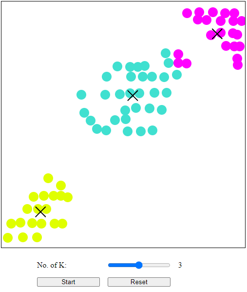

### K-mean Algorithm Visualization

Visualization of K-mean Algorithm. User must first define nodes locations and train data (nodes) will be your [x, y] locations of nodes. The algorithm will cluster k number of clusters that user defined with different colors.

##### References

- [codecademy.com - Machine Learning: Clustering with K-Means](https://www.codecademy.com/learn/machine-learning-clustering-with-k-means)